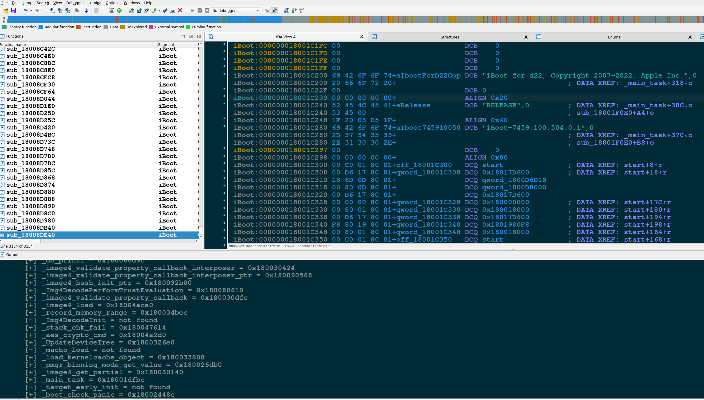

# iBoot64helper

## Introduction

**iBoot64helper** is now an IDA loader!

Just copy *iBoot64helper.py* to your *~/.idapro/loaders/* (or your *IDA/loaders/*)
directory, launch IDA, and open a *decrypted* iBoot, iBEC, or SecureROM binary image.

<p align="center"></p>

This aims to become an IDAPython utility to help with iBoot and SecureROM reverse
engineering. Currently it a) locates the image's proper loading address, b) rebases
the image, c) identifies functions based on common AArch64 function prologues, and
d) finds and renames some interesting functions.

As you can see in the screenshot below, 1920 functions
are recognized after running it on iBoot version 5540.0.129.

<p align="center"></p>

I will be adding features to it, identifying more functions, etc.

## IDA support

*iBoot64helper* now supports IDA 7.5 and lower versions (only tested with IDA's
builtin IDAPython for Python 3).

## Decrypting images

For decrypting images you should use [xerub's img4lib](https://github.com/xerub/img4lib);
the ultimate IMG4 utility.

## SecureROM

If you have a device vulnerable to [axi0mX's checkm8](https://github.com/axi0mX/ipwndfu),
you can use ```./ipwndfu --dump-rom``` to get a dump of the SecureROM image from your device
and use it with *iBoot64helper*.

## References
* [iOS RE Wiki](https://github.com/kpwn/iOSRE/blob/master/wiki/iBoot-RE.md)
* [img4lib](https://github.com/xerub/img4lib)
* [checkm8](https://github.com/axi0mX/ipwndfu)
